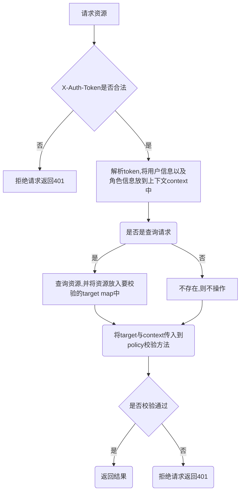

# 前言

keystone的policy.json是用于管理每个接口的访问权限的,它可以通过校验
角色或者校验资源中的指定字段来校验用户是否具有请求权限

# 流程图



# 样例

```json
{
  "admin_required": "role:admin or role:keystone_admin",
  "owner": "userId:%(id)s",
  "service_role": "role:service",
  "service_or_admin": "rule:admin_required or rule:service_role",
  "service_admin_or_owner": "rule:service_or_admin or rule:owner",

  "identity:list_users": "rule:admin_required or role:admin_read_only",
  "identity:get_user": "rule:admin_required or rule:owner or role:admin_read_only",
  "identity:create_user": "rule:admin_required",
  "identity:update_user": "rule:admin_required",
  "identity:delete_user": "rule:admin_required and not role:keystone_admin"

}
```

# 说明

policy.json包含了两个描述种类:

- Rule 对于需要多次用到的规则,可以先创建相应的Rule,在后续使用中只需传入
  Rule的name即可

- 接口权限定义

## 接口权限

### Key

接口权限的定义的key分为两个部分,以冒号分割,前半部分为服务的 名称,后半部分为接口的名称

### 操作符

- or:满足相连的规则之一即可
- and:必须同时满足规则
- not:必须不满足该规则

### Value

而具体的规则与规则之间通过空格来间隔,中间插入具体的连接操作符
而对于一个具体的规则用冒号分为两部分,前半部分描述要校验的字段name
或者为Rule校验,后半部分为具体的校验值,如果为校验资源内的指定字段
可以通过类似%(id)s这样的结构来说明其在资源中的名称(以便用过反射获取)

# GoStone改造后的结构

注:这里为了便于理解,使用了yaml的方式,后续也可以使用json等方式来描述

```yaml
Keystone:
  Rule:
    - Name: admin_required
      Operator: EQUAL
      Values:
        - Key: role
          Operator: IN
          Values:
            - admin
            - keystone_admin
    - Name: owner
      Operator: EQUAL
      Values:
        - Key: userId
          Operator: EQUAL
          Values: %id
    - Name: service_role
      Operator: EQUAL
      Values:
        - Key: role
          Operator: EQUAL
          Values: service
    - Name: service_or_admin
      Operator: OR
      Values:
        - Key: RULE
          Operator: EQUAL
          Values: admin_required
        - Key: RULE
          Operator: EQUAL
          Values: service_role
  Policy:
    - Name: list_users
      Operator: OR
      Values:
        - Key: RULE
          Operator: EQUAL
          Values: admin_required
        - Key: RULE
          Operator: EQUAL
          Values: owner
    - Name: get_project
      Operator: AND
      Values:
        - Key: RULE
          Operator: EQUAL
          Values: admin_required
        - Key: role
          Operator: NotEquals
          Values: keystone_admin
```

## 说明

yaml同样分为两个部分:

- Rule: 通用的规则
- Policy: 接口具体的规则

而具体的参数含义:

- Name：规则名称
- Operator：操作符
- Values: 规则具体的描述
- Key: RULE/具体的字段名称

